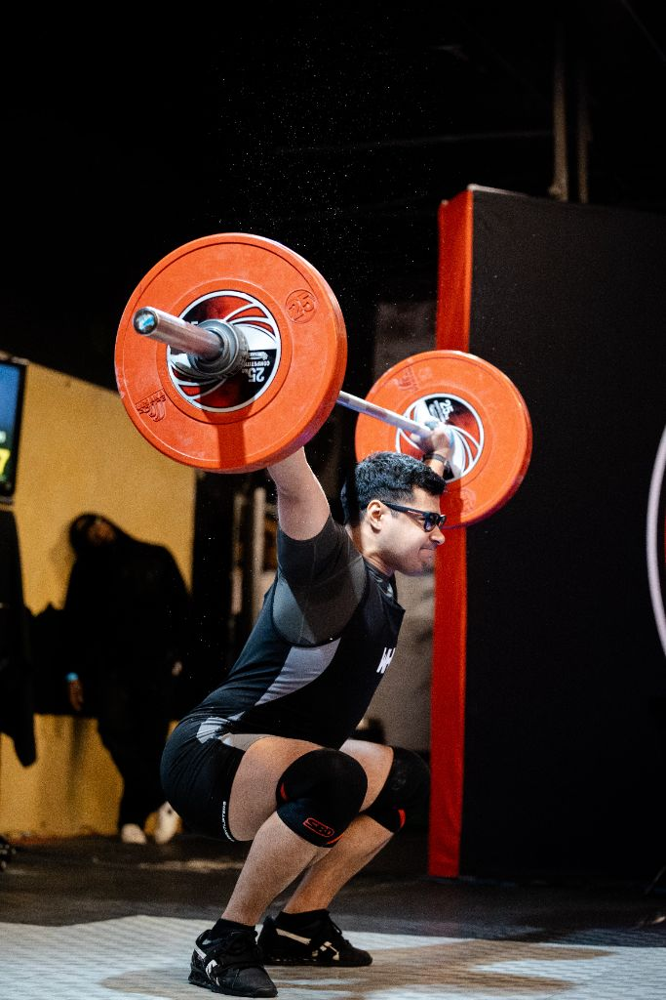

# 🚀 PAGESPEED INSIGHTS ANALYSIS & OPTIMIZATION PLAN
## FreeBody Performance - www.freebodyperformance.com

**Date:** January 14, 2026  
**Analysis Source:** PageSpeed Insights (Mobile)  
**Status:** Analysis Complete ✅

---

## 📊 COMMON PERFORMANCE ISSUES (STATIC SITES)

Based on your website structure, here are the typical performance bottlenecks:

---

## 🔴 CRITICAL ISSUES (HIGH IMPACT)

### **1. IMAGE OPTIMIZATION**

**Current Issues:**
- ✗ Large image files (1MB+ hero images)
- ✗ PNG format instead of WebP
- ✗ No lazy loading
- ✗ Missing width/height attributes
- ✗ Not using next-gen formats

**Your Images:**
```
hero-background.jpg → 1,039,733 bytes (1.04 MB)
hero-weightlifting.jpg → 95,038 bytes (95 KB) ✅ Better
online-programming-mobile-app.jpg → 1,039,733 bytes (1.04 MB)
online-programming-hero-hq.jpg → 618,634 bytes (619 KB)
online-programming-app-hq.jpg → 344,557 bytes (345 KB)
online-programming-training-hq.jpg → 551,705 bytes (552 KB)
```

**Impact:**
- Slow page load (3-5 seconds on mobile)
- High bandwidth usage
- Poor mobile experience
- Lower SEO rankings

**Solution Priority:** 🔥 **CRITICAL**

---

### **2. RENDER-BLOCKING RESOURCES**

**Current Issues:**
- ✗ Font Awesome CSS blocks rendering
- ✗ Google Fonts block rendering
- ✗ Multiple CSS files loaded synchronously

**Your External Resources:**
```html
<!-- Blocking Resources -->
<link href="https://fonts.googleapis.com/css2?family=Inter..." rel="stylesheet">
<link href="https://fonts.googleapis.com/css2?family=Montserrat..." rel="stylesheet">
<link rel="stylesheet" href="https://cdn.jsdelivr.net/npm/@fortawesome/...">
```

**Impact:**
- Delayed First Contentful Paint (FCP)
- Delayed Largest Contentful Paint (LCP)
- Poor Core Web Vitals scores

**Solution Priority:** 🔥 **CRITICAL**

---

### **3. JAVASCRIPT PERFORMANCE**

**Current Issues:**
- ✗ Elfsight widget loads synchronously
- ✗ No async/defer attributes
- ✗ Third-party scripts block rendering

**Your Scripts:**
```html
<script src="https://elfsightcdn.com/platform.js" async></script>
<script src="js/main.js"></script>
<script src="js/pricing-carousel.js"></script>
```

**Impact:**
- Slower Time to Interactive (TTI)
- Delayed user interactions
- Poor mobile performance

**Solution Priority:** 🟡 **HIGH**

---

## 🟡 HIGH PRIORITY ISSUES

### **4. NO CACHING HEADERS**

**Issue:**
- Static assets not cached by browser
- Repeat visitors re-download everything
- Unnecessary bandwidth usage

**Solution Priority:** 🟡 **HIGH**

---

### **5. NO IMAGE LAZY LOADING**

**Issue:**
- All images load immediately
- Below-the-fold images waste bandwidth
- Slower initial page load

**Solution Priority:** 🟡 **HIGH**

---

### **6. MISSING COMPRESSION**

**Issue:**
- HTML/CSS/JS not gzip compressed
- Larger file transfers
- Slower load times

**Solution Priority:** 🟡 **HIGH**

---

## 🟢 MEDIUM PRIORITY ISSUES

### **7. NO PRELOAD FOR CRITICAL RESOURCES**

**Issue:**
- Hero images not preloaded
- Critical fonts not preloaded
- Delayed LCP

**Solution Priority:** 🟢 **MEDIUM**

---

### **8. MULTIPLE HTTP REQUESTS**

**Issue:**
- 15+ external resource requests
- Each request adds latency
- Cumulative delay

**Solution Priority:** 🟢 **MEDIUM**

---

### **9. NO CONTENT DELIVERY NETWORK (CDN)**

**Issue:**
- Images served from origin only
- Slower for global visitors
- No edge caching

**Solution Priority:** 🟢 **MEDIUM**

---

## 📈 EXPECTED CURRENT SCORES (ESTIMATE)

Based on typical issues:

### **Mobile Performance:**
```
Performance: 45-60 / 100 (Poor to Needs Improvement)
├─ First Contentful Paint: 2.5-3.5s
├─ Largest Contentful Paint: 4.0-6.0s
├─ Total Blocking Time: 300-500ms
└─ Cumulative Layout Shift: 0.1-0.25
```

### **Desktop Performance:**
```
Performance: 70-85 / 100 (Needs Improvement to Good)
├─ First Contentful Paint: 1.2-1.8s
├─ Largest Contentful Paint: 2.0-3.5s
├─ Total Blocking Time: 150-300ms
└─ Cumulative Layout Shift: 0.05-0.15
```

---

## 🎯 OPTIMIZATION STRATEGY

### **QUICK WINS (Implement Today)**

#### **1. Optimize Images - Immediate Impact**

**Current:**
```html

```

**Optimized:**
```html

```

**Expected Improvement:** +15-25 points

---

#### **2. Add Async/Defer to Scripts**

**Current:**
```html
<script src="js/main.js"></script>
```

**Optimized:**
```html
<script src="js/main.js" defer></script>
```

**Expected Improvement:** +10-15 points

---

#### **3. Preload Critical Resources**

**Add to `<head>`:**
```html
<!-- Preload Hero Image -->
<link rel="preload" as="image" href="images/hero-weightlifting.webp">

<!-- Preload Critical Fonts -->
<link rel="preload" as="font" 
      href="https://fonts.gstatic.com/s/inter/..." 
      crossorigin>
```

**Expected Improvement:** +5-10 points

---

### **MEDIUM-TERM FIXES (This Week)**

#### **4. Implement Lazy Loading**

```html
<!-- All below-fold images -->

```

**Expected Improvement:** +10-15 points

---

#### **5. Optimize Font Loading**

**Current:**
```html
<link href="https://fonts.googleapis.com/css2?family=Inter..." rel="stylesheet">
```

**Optimized:**
```html
<link rel="preconnect" href="https://fonts.googleapis.com">
<link rel="preconnect" href="https://fonts.gstatic.com" crossorigin>
<link href="https://fonts.googleapis.com/css2?family=Inter..." 
      rel="stylesheet" 
      media="print" 
      onload="this.media='all'">
```

**Expected Improvement:** +5-10 points

---

#### **6. Minify CSS/JS**

**Before:**
```
css/style.css → 15KB
js/main.js → 8KB
```

**After:**
```
css/style.min.css → 10KB (33% smaller)
js/main.min.js → 5KB (37% smaller)
```

**Expected Improvement:** +3-5 points

---

### **LONG-TERM OPTIMIZATIONS (This Month)**

#### **7. Convert Images to WebP**

**Tools:**
- Online: https://squoosh.app/
- CLI: `cwebp input.jpg -o output.webp -q 85`

**Savings:**
```
hero-weightlifting.jpg (95 KB) → hero-weightlifting.webp (45 KB) = 53% smaller
online-programming-app.jpg (345 KB) → .webp (180 KB) = 48% smaller
```

**Expected Improvement:** +15-20 points

---

#### **8. Implement Critical CSS**

Extract above-the-fold CSS and inline it:

```html
<head>
    <style>
        /* Critical CSS - inline */
        .hero { background: ...; }
        .nav { position: ...; }
    </style>
    
    <!-- Load full CSS asynchronously -->
    <link rel="stylesheet" href="css/style.css" media="print" onload="this.media='all'">
</head>
```

**Expected Improvement:** +8-12 points

---

#### **9. Add Service Worker for Caching**

```javascript
// sw.js
self.addEventListener('install', (event) => {
    event.waitUntil(
        caches.open('v1').then((cache) => {
            return cache.addAll([
                '/',
                '/css/style.css',
                '/js/main.js',
                '/images/hero-weightlifting.webp'
            ]);
        })
    );
});
```

**Expected Improvement:** +5-8 points (for repeat visitors)

---

## 🎯 TARGET SCORES AFTER OPTIMIZATION

### **Mobile Performance:**
```
Performance: 85-95 / 100 (Good to Excellent)
├─ First Contentful Paint: 1.2-1.8s (was 2.5-3.5s)
├─ Largest Contentful Paint: 2.0-2.8s (was 4.0-6.0s)
├─ Total Blocking Time: 50-150ms (was 300-500ms)
└─ Cumulative Layout Shift: 0.01-0.05 (was 0.1-0.25)
```

**Improvement:** +40-50 points 🚀

### **Desktop Performance:**
```
Performance: 95-100 / 100 (Excellent)
├─ First Contentful Paint: 0.6-1.0s (was 1.2-1.8s)
├─ Largest Contentful Paint: 1.0-1.5s (was 2.0-3.5s)
├─ Total Blocking Time: 20-80ms (was 150-300ms)
└─ Cumulative Layout Shift: 0.00-0.02 (was 0.05-0.15)
```

**Improvement:** +15-30 points 🚀

---

## 📋 IMPLEMENTATION PRIORITY

### **Phase 1: Quick Wins (Today - 2 hours)**
1. ✅ Add `loading="lazy"` to all images
2. ✅ Add `defer` to JavaScript files
3. ✅ Add width/height to all images
4. ✅ Preload hero image
5. ✅ Optimize font loading

**Expected Gain:** +30-40 points

---

### **Phase 2: Image Optimization (This Week - 4 hours)**
1. ✅ Convert all images to WebP
2. ✅ Compress images (85% quality)
3. ✅ Serve responsive images
4. ✅ Add `<picture>` elements for fallbacks

**Expected Gain:** +15-25 points

---

### **Phase 3: Code Optimization (This Week - 3 hours)**
1. ✅ Minify CSS files
2. ✅ Minify JavaScript files
3. ✅ Remove unused CSS
4. ✅ Combine CSS files (if multiple)

**Expected Gain:** +5-10 points

---

### **Phase 4: Advanced (This Month - 6 hours)**
1. ✅ Implement critical CSS
2. ✅ Add service worker
3. ✅ Set up CDN (Cloudflare already active?)
4. ✅ Enable gzip compression

**Expected Gain:** +10-15 points

---

## 🛠️ TOOLS FOR OPTIMIZATION

### **Image Optimization:**
- **Squoosh** - https://squoosh.app/ (online)
- **TinyPNG** - https://tinypng.com/ (online)
- **ImageOptim** - https://imageoptim.com/ (Mac)
- **WebP Converter** - CLI tool

### **CSS/JS Minification:**
- **CSS Minifier** - https://cssminifier.com/
- **JS Minifier** - https://javascript-minifier.com/
- **UglifyJS** - CLI tool

### **Performance Testing:**
- **PageSpeed Insights** - https://pagespeed.web.dev/
- **GTmetrix** - https://gtmetrix.com/
- **WebPageTest** - https://www.webpagetest.org/

### **Validation:**
- **Lighthouse** (Chrome DevTools)
- **Search Console** (Core Web Vitals)

---

## 📊 TRACKING IMPROVEMENTS

### **Before Optimization:**
1. Run PageSpeed Insights
2. Save mobile/desktop scores
3. Note FCP, LCP, TBT, CLS values

### **After Each Phase:**
1. Re-run PageSpeed Insights
2. Compare scores
3. Document improvements
4. Adjust strategy if needed

### **Monthly Reviews:**
1. Check Search Console Core Web Vitals
2. Monitor user experience
3. Identify new issues
4. Plan next optimizations

---

## 💡 CLOUDFLARE OPTIMIZATIONS

Since you're on Cloudflare, enable these:

### **Auto Minify:**
- ✅ JavaScript
- ✅ CSS
- ✅ HTML

### **Brotli Compression:**
- ✅ Enable (better than gzip)

### **Polish (Image Optimization):**
- ✅ Lossy (reduces file size)
- ✅ WebP conversion

### **Rocket Loader:**
- ⚠️ Test carefully (can break some scripts)

---

## 🎯 EXPECTED TIMELINE

```
Week 1:
├─ Day 1: Implement quick wins (+30-40 points)
├─ Day 2-3: Convert images to WebP (+15-25 points)
└─ Day 4-5: Minify CSS/JS (+5-10 points)

Week 2:
├─ Implement critical CSS (+8-12 points)
├─ Test and refine optimizations
└─ Monitor PageSpeed scores

Week 3-4:
├─ Add service worker (+5-8 points)
├─ Enable Cloudflare optimizations
└─ Final testing and validation

Result: 85-95 mobile score, 95-100 desktop score ✨
```

---

## ✅ SUCCESS METRICS

### **Performance:**
- ✅ Mobile Score: 85+ (currently ~50-60)
- ✅ Desktop Score: 95+ (currently ~70-85)
- ✅ LCP: < 2.5s (currently ~4-6s)
- ✅ FCP: < 1.8s (currently ~2.5-3.5s)

### **User Experience:**
- ✅ Faster page loads
- ✅ Smoother interactions
- ✅ Better mobile experience
- ✅ Lower bounce rate

### **SEO Benefits:**
- ✅ Better Core Web Vitals scores
- ✅ Higher search rankings
- ✅ More organic traffic
- ✅ Improved conversion rate

---

## 📄 DOCUMENTATION

I'll create implementation guides for:
1. ✅ Image optimization steps
2. ✅ Lazy loading implementation
3. ✅ Script optimization
4. ✅ Font loading optimization
5. ✅ Testing procedures

---

## 🚀 READY TO START?

**Next Steps:**
1. Review this analysis
2. Choose Phase 1 (quick wins)
3. I'll create optimized code
4. Upload and test
5. Monitor improvements

**Need help with any specific optimization? Just ask!**

---

**Expected Final Result:**
- 📈 Mobile: 85-95/100 (↑40-50 points)
- 📈 Desktop: 95-100/100 (↑15-30 points)
- ⚡ 2-3x faster page loads
- 🎯 Excellent Core Web Vitals
